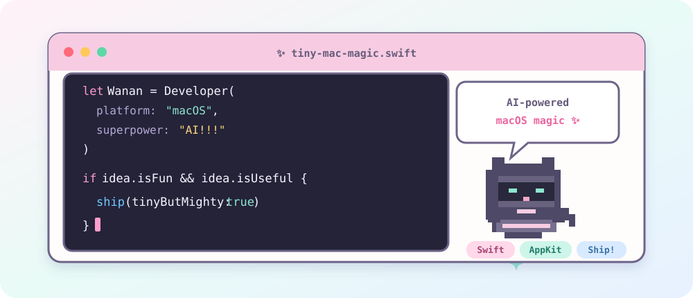

<div align="center">
  
</div>

<p align="center">
  <a href="https://github.com/iFaNGMiNGi?tab=repositories"></a>
  <a href="https://github.com/iFaNGMiNGi/Wamactools"></a>
</p>

## `~/about`

I build and refine small macOS tools: practical utilities, clean interaction details, and workflows that feel native on the Mac.

I care about:

- Swift and AppKit/SwiftUI desktop apps
- macOS menu bar tools, keyboard workflows, and window switching
- product polish: release pages, onboarding copy, localization, and tiny UX fixes
- AI-assisted local workflows that keep the shipped product simple

## `~/featured`

| Project | What it is | Stack |
| --- | --- | --- |
| [**WaMacTools**](https://github.com/iFaNGMiNGi/Wamactools) | Native menu bar toolbox for cleaning lock, privacy, window management, Finder, display, battery, and network checks | `Swift` `macOS` |
| [**Surge Config**](https://github.com/iFaNGMiNGi/Surge-Config) | Public routing configuration for Surge 6 | `Network` `Config` |

## `~/toolkit`

<p>
  
</p>

```swift
let principles = [
    "macOS first": "native feel over flashy demos",
    "small utilities": "narrow scope, useful every day",
    "product polish": "copy, defaults, packaging, release flow"
]
```

## `~/now`

- Shipping small macOS utilities with clean defaults
- Keeping public project pages simple and clear
- Polishing Swift desktop workflows before adding new scope

<p align="center">
  <sub>Build small. Polish hard. Ship useful.</sub>
</p>
